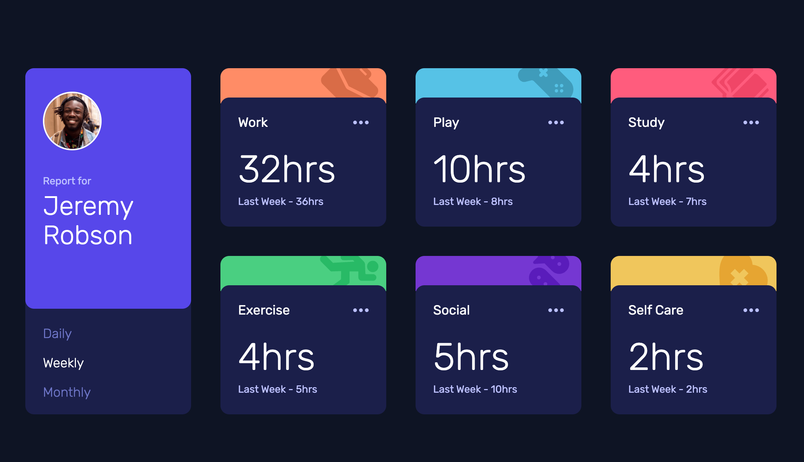

# Frontend Mentor - Time tracking dashboard solution

This is a solution to the [[Time tracking dashboard challenge on Frontend Mentor](https://www.frontendmentor.io/challenges/time-tracking-dashboard-UIQ7167Jw).

## Table of contents

- [Overview](#overview)
  - [The challenge](#the-challenge)
  - [Screenshot](#screenshot)
  - [Links](#links)
  - [Built with](#built-with)

## Overview

### The challenge

Users should be able to:

- View the optimal layout for the site depending on their device's screen size
- See hover states for all interactive elements on the page
- Switch between viewing Daily, Weekly, and Monthly stats

### Screenshot

### Links
- Solution URL: [https://www.frontendmentor.io/solutions/time-tracking-dashboard-html-tailwind-css-js-aDlreo4O_d](https://www.frontendmentor.io/solutions/time-tracking-dashboard-html-tailwind-css-js-aDlreo4O_d)
- Live Site URL: [https://jamesa14.github.io/fm--time-tracking-dashboard/](https://jamesa14.github.io/fm--time-tracking-dashboard/)

### Built with

- HTML5
- Tailwind CSS
- JavaScript
